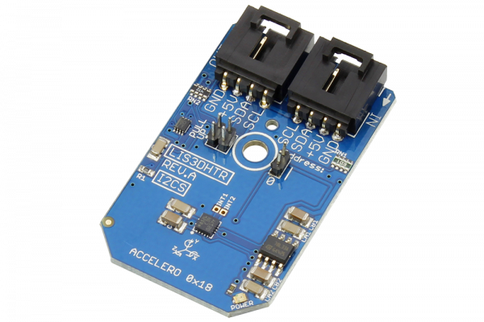

# LIS3DHTR

Manufactured by STMicroelectronics, the LIS3DHTR  has dynamically user-selectable full scales of ±2g/±4g/±8g/±16g and it is capable of measuring accelerations with output data rates from 1Hz to 5kHz.
This Device is available from www.ncd.io 

[SKU: LIS3DHTR_I2CS]

(https://store.ncd.io/product/lis3dhtr-3-axis-accelerometer-digital-output-motion-sensor-i2c-mini-module/)
This Sample code can be used with Arduino.

Hardware needed to interface LIS3DHTR sensor with Arduino

1. <a href="https://store.ncd.io/product/i2c-shield-for-arduino-nano/">Arduino Nano</a>

2. <a href="https://store.ncd.io/product/i2c-shield-for-arduino-micro-with-i2c-expansion-port/">Arduino Micro</a>

3. <a href="https://store.ncd.io/product/i2c-shield-for-arduino-uno/">Arduino uno</a>

4. <a href="https://store.ncd.io/product/dual-i2c-shield-for-arduino-due-with-modular-communications-interface/">Arduino Due</a>

5. <a href="https://store.ncd.io/product/lis3dhtr-3-axis-accelerometer-digital-output-motion-sensor-i2c-mini-module/">LIS3DHTR 3-Axis Accelerometer Digital Output Motion Sensor</a>

6. <a href="https://store.ncd.io/product/i%C2%B2c-cable/">I2C Cable</a>

LIS3DHTR:

Manufactured by STMicroelectronics, the LIS3DHTR  has dynamically user-selectable full scales of ±2g/±4g/±8g/±16g and it is capable of measuring accelerations with output data rates from 1Hz to 5kHz.

Applications:

• motion-activated functions

• display orientation

• gaming and virtual reality input devices

• impact recognition and logging

• vibration monitoring and compensation and  etc.

How to Use the LIS3DHTR Arduino Library

The LIS3DHTR has a number of settings, which can be configured based on user requirements.
          
1.Data rate setting:The following command is used to set the resolution of sensor for humidity and temperature.

            lis.setAccelDataRate(ACCEL_DATARATE_1HZ);           // AODR (Hz): 1
            
2.Output acceleration range:The following command is used to select the output acceleration range.

            lis.setAccelRange(ACCEL_RANGE_16G);                 // ±16 G
            
